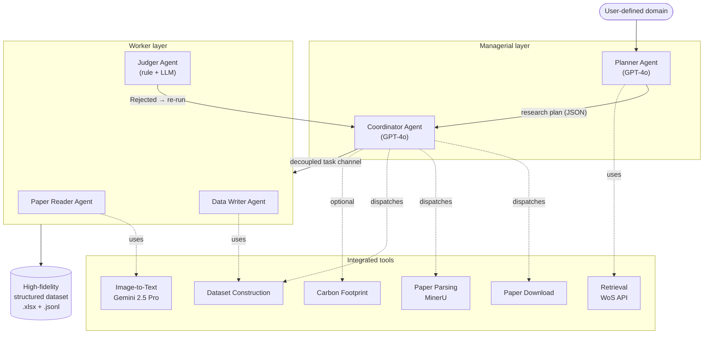

<div align="center">

# MACS-BiC

### A Multi-Agent LLM System for High-Fidelity Knowledge Extraction in Sustainable Construction Materials

*Autonomously transforming the fragmented, multi-modal scientific literature on biochar-in-construction into an analysis-ready structured dataset.*

[-1f6feb)]()
[](https://www.python.org/)
[](#license)
[](https://github.com/opendatalab/mineru)
[]()
[]()
[]()

</div>

---

## 1. Overview

The construction sector accounts for a substantial fraction of global CO<sub>2</sub> emissions, and **biochar**—a carbon-rich solid produced via biomass pyrolysis—has emerged as a uniquely dual-function admixture that simultaneously stores carbon and modifies composite performance. Despite explosive research growth, the quantitative evidence needed to resolve biochar's central **performance–decarbonization trade-off** is *fragmented across unstructured, multi-modal scientific literature*, with the majority of numerical data trapped inside figures and tables that are invisible to conventional text-mining pipelines.

**MACS-BiC** (Multi-Agent Comprehension System for *Biochar in Construction*) is an AI-native framework that autonomously turns this fragmented literature into a high-fidelity, analysis-ready, structured dataset. It couples a **hierarchical multi-agent orchestration model** with a **domain-expert-designed 16-question extraction protocol** and an **integrated image-to-text module** that resolves the cross-modal evidence gap.

Deployed on a curated corpus of **662 full-text articles**, MACS-BiC achieves an **overall exact field matching rate of 98.75%**, substantially surpassing four state-of-the-art commercial LLMs (GPT-5, GPT-4o, Gemini 2.5 Pro, DeepSeek 3.2) and all ablated variants.

> This repository accompanies the manuscript<br>
> **"A multi-agent LLM system for high-fidelity knowledge extraction in sustainable construction materials"**<br>
> *Shuai Zou\*, Zhihan Guo\*, Yankai Chen, Jianzhuang Xiao, Chi Sun Poon, Philip S. Yu, Irwin King — currently under review at* ***Nature Communications***.

---

## 2. Key Contributions

- **AI-native framework for materials-science knowledge synthesis.** A hierarchical, multi-agent architecture that decomposes the analysis of every paper into parallelizable subtasks orchestrated through a stateless task channel.
- **Domain-expert-driven extraction protocol.** A 16-question, dependency-aware questionnaire that traces the causal pathway *feedstock → pyrolysis → mixture design → multi-dimensional performance* and enforces schema-constrained, context-bound answers.
- **Multi-modal evidence resolution.** An integrated image-to-text module converts figures and tables into semantic markdown tables, unlocking the >50% of quantitative evidence that resides in visual content.
- **Closed-loop quality control.** A hybrid rule-based + LLM-based Judger validates every record and triggers automatic re-execution on rejection, yielding the highest NaN F1-score (0.9655) of any evaluated system.
- **The first high-fidelity, analysis-ready dataset on biochar-in-construction.** Structured Q&A for 662 papers spanning feedstock, pyrolysis, formulation, and 11 performance dimensions—enabling the first quantitative, statistical interrogation of biochar's performance–decarbonization trade-off.

---

## 3. System Architecture

MACS-BiC is organized as **two managerial agents** that orchestrate **three specialist worker agents**, integrated with **six domain-specific tools**.



### 3.1 Agents

| Agent | Role | Backbone |
|---|---|---|
| **Planner** | Performs semantic expansion of the user topic, generates domain keywords, and invokes the Retrieval Tool to compile a deduplicated target paper list. | GPT-4o |
| **Coordinator** | Central orchestration hub. Decomposes analysis of each paper into four parallelizable subtasks (acquisition, comprehension, compilation, verification) and dispatches them to workers via a stateless task channel. | GPT-4o |
| **Paper Reader** | Performs deep semantic understanding. Calls the Image-to-Text Tool, fuses textual + visual evidence, and iteratively answers the 16-question protocol. | GPT-4o |
| **Data Writer** | Aggregates multi-turn answers, applies schema-driven decoding (unit canonization, round-half-up precision, multi-valued arrays, citation binding), and emits structured JSON records. | GPT-4o |
| **Judger** | Closed-loop quality control. Rule-based syntactic validation + LLM-based semantic accuracy check; emits `Accepted` / `Rejected`; failed subtasks are auto-rescheduled. | GPT-4o |

### 3.2 Tools

| # | Tool | Function |
|---|---|---|
| 1 | **Retrieval** | Executes structured Boolean queries on the Web of Science API; normalizes results to a canonical schema; deduplicates by DOI + title similarity. |
| 2 | **Paper Download** | Resolves DOIs against institutional subscriptions and open-access repositories; logs unauthorized failures and excludes them. |
| 3 | **Paper Parsing** | Four-phase MinerU pipeline: PDF validation (PyMuPDF) → layout/figure/table extraction → reading-order repair → emit Markdown + JPG assets. |
| 4 | **Image-to-Text** | Gemini-2.5-Pro converts figures to semantic Markdown tables (preserving headers, units, values) or one-sentence descriptions for non-chart images. |
| 5 | **Carbon Footprint** | Standardized LCA: `f(cf) = Σ_k m_k · CEF_k` over cement, slag, fly ash, silica fume, biochar, fiber, water, sand, gravel, BDA, admixture, other. |
| 6 | **Dataset Construction** | Enforces schema constraints; merges multi-turn answers from parallel experimental groups; canonizes units; validates data types; emits the final dataset. |

---

## 4. Headline Results

### 4.1 Extraction performance vs. commercial LLMs and ablated variants

Evaluated on a manually verified gold-standard dataset of **40 samples × 160 data points** drawn from 7 peer-reviewed articles (10% of the corpus). Numbers are reported as **EFM(%) / MAE** for numerical fields, **EFM(%) / F1-macro** for category, and **F1** for NaN. **Overall** is the composite Exact Field Matching rate.

| Model | Category | Density | Strength | Slump | NaN F1 | **Overall EFM** |
|---|---|---|---|---|---|---|
| **MACS-BiC (full)** | **100 / 1.0000** | **100 / 1.333** | **100 / 0.106** | **95.0 / 0.462** | **0.9655** | **98.750** |
| MACS-BiC — w/o image-to-text | 100 / 1.0000 | 67.5 / 1756 | 42.5 / 77.16 | 75.0 / 106.1 | 0.5660 | 71.250 |
| MACS-BiC — w/o format normalization | 15.0 / 0.1176 | 30.0 / 2558 | 35.0 / 65.03 | 52.5 / 143.0 | 0.4427 | 33.125 |
| MACS-BiC — w/o loop | 100 / 1.0000 | 97.5 / 59.60 | 100 / 0.106 | 92.5 / 0.462 | 0.9310 | 97.500 |
| MACS-BiC — w/o notes | 87.0 / 0.8750 | 92.5 / 300.0 | 87.5 / 16.92 | 90.0 / 21.00 | 0.7671 | 89.375 |
| DeepSeek 3.2 | 100 / 1.0000 | 67.5 / 1756 | 27.5 / 81.10 | 67.5 / 124.0 | 0.5556 | 65.625 |
| Gemini 2.5 Pro | 95.0 / 0.9268 | 62.5 / 1767 | 52.5 / 28.25 | 72.5 / 14.27 | 0.6923 | 70.625 |
| GPT-5 | 95.0 / 0.9048 | 67.5 / 1756 | 45.0 / 42.00 | 70.0 / 112.8 | 0.6186 | 69.375 |
| GPT-4o | 82.5 / 0.8049 | 62.5 / 179.9 | 42.5 / 7.918 | 65.0 / 19.38 | 0.8956 | 63.125 |

The ablation study quantifies two pivotal findings:

1. **The image-to-text module is the central bottleneck.** Disabling it collapses density MAE from **1.333 → 1756** and strength EFM from **100% → 42.5%**, validating that the primary barrier to high-fidelity dataset construction is the cross-modal gap, not natural-language understanding.
2. **Format normalization is essential for categorical understanding.** Removing it drops the category F1-macro from **1.0000 → 0.1176**, even though the underlying LLM is identical—confirming that *parsing*, not *reasoning*, dominates categorical fidelity.

### 4.2 Knowledge synthesized from the 662-paper corpus

- **Median biochar dosage of only 1.40 wt.%**, with 75% of studies using <5.9% — quantitatively confirming the field's conservative, strength-loss-averse paradigm.
- **A statistically significant strength penalty at high substitution:** mean compressive strength deteriorates from **41.7 MPa (0–5 wt.%)** to **13.3 MPa (>20 wt.%)**.
- A multi-parameter assessment combining mechanical, durability, *and* environmental metrics covers a mere **0.12%** of studies, exposing the field's siloed evaluation landscape.

See the manuscript and `Supplementary Data 4` for the complete dataset and figure-level analyses.

---

## 5. Repository Layout

```
MACS-BiC/
├── README.md
└── agent/
    ├── extraction.py                       # Production entry point (legacy / scripted run)
    ├── extraction_without_format.py        # Ablation: w/o format normalization
    ├── extraction_without_image_translation.py
    ├── extraction_without_loop.py          # Ablation: single-pass extraction
    ├── extraction_without_notes.py         # Ablation: w/o domain glossary / notes
    │
    ├── prompt/                             # Prompt library (Stage 1 + Stage 2, ablations)
    │   ├── prompt1.py                      # Stage 1: triage / preliminary identification
    │   ├── prompt1_200.py
    │   ├── prompt1_pdf.py
    │   ├── prompt1_without_format.py
    │   ├── prompt1_without_notes.py
    │   ├── prompt2.py                      # Stage 2: context-aware comprehensive extraction
    │   ├── prompt2_200.py
    │   ├── prompt2_200_20250917.py
    │   ├── prompt2_200_20250918.py
    │   ├── prompt2_200_20250918_2.py
    │   ├── prompt2_without_format.py
    │   ├── prompt2_without_image_translator.py
    │   └── prompt2_without_notes.py
    │
    ├── utils/
    │   └── utils.py                        # Extraction pipeline, image-to-text, schema enforcement
    │
    ├── tools/
    │   └── carbon_footprint_calculating.docx
    │
    └── multi_agent/                        # Modern, modular multi-agent implementation
        ├── base_agent.py                   # ReAct base agent
        ├── llm_client.py                   # Unified GPT-4o / Gemini wrapper
        ├── mcp_tool.py                     # @mcp_tool decorator + registry
        ├── multi_agent_system.py           # Top-level façade
        ├── system_usage_example.py         # End-to-end CLI entry point
        ├── agents/
        │   ├── planner.py
        │   ├── coordinator.py
        │   ├── paper_reader.py
        │   ├── data_writer.py
        │   └── judger.py
        └── tools/
            ├── retrieval.py
            ├── paper_download.py
            ├── paper_parsing.py            # MinerU subprocess wrapper
            ├── image_to_text.py            # Gemini-2.5-Pro figure → markdown
            ├── carbon_footprint.py         # LCA formula from Supplementary Note 3.5
            └── dataset_construction.py     # JSONL → canonical Excel
```

---

## 6. Installation

### 6.1 Prerequisites

- Python ≥ 3.10
- A GPU is recommended if you intend to run MinerU with its VLM backends; the default `pipeline` backend is CPU-friendly.
- API access:
  - **OpenAI / GPT-4o** (or a compatible proxy) — for every LLM-driven agent.
  - **Gemini 2.5 Pro** — for the Image-to-Text tool (can share the OpenAI-compatible proxy URL).
  - **Web of Science (Starter or Expanded) API** — for the Retrieval tool.

### 6.2 Install

```bash
git clone https://github.com/zhihan-guo/MACS-BiC.git
cd MACS-BiC

python -m venv .venv && source .venv/bin/activate
pip install --upgrade pip
pip install openai requests pandas openpyxl httpx pydantic
pip install --upgrade "mineru[core]"           # PDF parsing
```

### 6.3 Configure credentials

```bash
export OPENAI_API_KEY="sk-..."                  # GPT-4o (and default for Gemini proxy)
export WOS_API_KEY="..."                        # Web of Science
export GEMINI_API_KEY="..."                     # Optional; falls back to OPENAI_API_KEY
```

---

## 7. Quick Start

### 7.1 End-to-end pipeline (agentic mode)

The Planner produces a JSON plan and hands it to the Coordinator, which drives the 8-stage pipeline through ReAct tool calls.

```bash
python -m agent.multi_agent.system_usage_example \
    --domain "biochar-integrated construction materials carbon footprint" \
    --workspace ./run_biochar \
    --max-records 50 \
    --mode agentic
```

### 7.2 End-to-end pipeline (programmatic mode)

Bypasses the ReAct loop and invokes each Coordinator stage directly — ideal for CI and unit tests.

```python
from agent.multi_agent.multi_agent_system import MultiAgentSystem

mas = MultiAgentSystem(
    api_key="sk-...",
    base_url="https://az.gptplus5.com/v1",
    model_name="gpt-4o-2024-11-20",
    wos_api_key="...",
)

result = mas.run_programmatic(
    domain="biochar in construction",
    workspace="./run_biochar",
    max_records=100,
    required_questions=["1.1", "3.5", "3.6", "3.9"],
)

print(result["context"]["dataset"])     # path to the final .xlsx
```

The `workspace` folder will be populated as follows:

```
run_biochar/
├── pdfs/                  # downloaded full-text PDFs
├── parsed/                # MinerU markdown + figures, one folder per DOI
├── image_text/            # Gemini chart-to-table JSONL cache
├── results1/              # Stage-1 (triage) answers cache
├── extractions/           # per-DOI JSONL Q&A (canonical schema)
└── dataset.xlsx           # final analysis-ready spreadsheet
```

### 7.3 Just the carbon-footprint tool

```python
from agent.multi_agent.tools.carbon_footprint import carbon_footprint_calculating

mixture = {
    "cement":  0.30,  # mass fraction
    "biochar": 0.05,
    "water":   0.15,
    "sand":    0.30,
    "gravel":  0.20,
}
out = carbon_footprint_calculating(mixture)
print(out["data"]["f_cf"], "kg CO2-eq per unit mass")
# -> 106.71 kg CO2-eq per unit mass
```

---

## 8. The 16-Question Extraction Protocol

Co-designed with domain experts, the protocol traces the **causal chain** `feedstock → pyrolysis → mixture design → performance`. It is enforced through two stages with strict schema constraints, dynamic branching, and explicit abstention.

### Stage 1 — Triage (binary)

| # | Question | Output |
|---|---|---|
| 1.1 | Categories of mixture / formulation design used (alphanumeric IDs) | comma-separated list |
| 2.1 | Is modulus property included? | yes / no |
| 2.2 | Is durability included? | yes / no |
| 2.3 | Is fire-resistance performance included? | yes / no |
| 2.4 | Is carbon footprint analyzed? | yes / no |

### Stage 2 — Context-aware comprehensive extraction (pre-conditioned on the Stage-1 categories)

| # | Question | Output schema |
|---|---|---|
| 3.1 | Feedstock / biomass types | comma-separated short phrases |
| 3.2 | Feedstock classification (a–h) | letter list |
| 3.3 | Pyrolysis temperature | integer °C |
| 3.4 | Biochar role / function (a–d) | letter |
| 3.5 | Type of biochar-integrated material (a–i) | letter |
| 3.6 | Biochar / total-mixture mass ratio | float (3 d.p.) |
| 3.7 | Biochar / cementitious mass ratio | float (2 d.p.) |
| 3.8 | Hardened density | integer kg/m³, ± SD |
| 3.9 | 28-day compressive strength | float MPa (1 d.p.), ± SD |
| 3.10 | Flow-table / slump | integer mm, ± SD |
| 3.11 | Thermal conductivity (28 d) | float W/(m·K), 2 d.p., ± SD |

Every Stage-2 prompt encapsulates six standardized components: **task instruction**, **domain glossary**, **schema constraints**, **machine-readable mandate**, **citation binding**, and **explicit `nan` abstention policy**. Decoding is configured for determinism with reasoning effort set to `medium`.

The dynamic execution engine adds two mechanisms on top:

- **One-to-many branching:** parallel question threads spawned per experimental entity (e.g. multiple biochar types within one paper).
- **Combinatorial permutation:** a Cartesian product is taken over independent variables (e.g. 2 biochar types × 3 cement-replacement ratios), so every data point is uniquely bound to its precise context.

---

## 9. Reproducing the Evaluation

The gold-standard dataset, every model's predictions, and the full per-metric breakdowns are released alongside the manuscript:

| File | Description |
|---|---|
| `Supplementary Data 1` | 801 retrieved Web of Science records |
| `Supplementary Data 2` | Bibliometric overview of the retrieved literature |
| `Supplementary Data 3` | Screening strategy and final 662-DOI corpus |
| `Supplementary Data 4` | **Final structured dataset extracted by MACS-BiC** |
| `Supplementary Data 5` | Gold standard vs. each model's extracted data |
| `Supplementary Data 6` | Full evaluation results per metric |

To re-run the four ablations:

```bash
# Full MACS-BiC
python agent/extraction.py --model gpt-4o-2024-11-20 \
       --output_path out/full --dataset_name pdfs/ \
       --parsing_path parsed/ --image_output_path image_text/ \
       --result1 results1/

# Ablation: w/o image-to-text
python agent/extraction_without_image_translation.py ...

# Ablation: w/o format normalization
python agent/extraction_without_format.py ...

# Ablation: w/o loop (single-pass)
python agent/extraction_without_loop.py ...

# Ablation: w/o notes (no glossary)
python agent/extraction_without_notes.py ...
```

Evaluation metrics are formally defined in **Supplementary Note 8**:

- **Macro-averaged F1-score** for categorical fields (eliminates class-imbalance bias).
- **R² and MAE** for numerical fields, with a penalty term that maps `predicted = nan` on a valid target to `3 × true_value` (penalises silent omission).
- **NaN F1-score** for anti-hallucination capability on absent evidence.
- **Exact Field Matching (EFM)**: case-/whitespace-insensitive string equality for categorical fields, relative-error ≤ 5% for numerical fields.

---

## 10. Web-of-Science Search Strategy

The corpus was assembled with a three-component Boolean query (Supplementary Note 1):

```text
TS = (biochar)
AND
TS = (cement OR aggregate OR admixture OR additive OR filler)
AND
TS = (concrete OR mortar OR paste OR paving brick OR permeable brick
      OR eco-brick OR bricks OR gypsum board OR insulation board
      OR composite materials OR 3D printing materials OR coating)
```

Execution date: **2025-08-13**, English-only, no other restrictions. Funnel: 801 records → 781 with DOI → 763 retrievable → 676 non-review → 662 parseable & within token budget.

---

## 11. Citation

If you use MACS-BiC, the released dataset, or any of the prompts in your work, please cite:

```bibtex
@article{zou2026macsbic,
  title   = {A multi-agent LLM system for high-fidelity knowledge extraction in
             sustainable construction materials},
  author  = {Zou, Shuai and Guo, Zhihan and Chen, Yankai and Xiao, Jianzhuang
             and Poon, Chi Sun and Yu, Philip S. and King, Irwin},
  journal = {Nature Communications},
  year    = {2026},
  note    = {Under review}
}
```

---

## 12. Acknowledgements

This research is financially supported by the **Innovation and Technology Fund**, the **Nano and Advanced Materials Institute**, **The Hong Kong Polytechnic University**, and **The Chinese University of Hong Kong**.

We are grateful to the maintainers of the open-source tools on which MACS-BiC depends, in particular [MinerU](https://github.com/opendatalab/mineru) for high-fidelity PDF parsing and the OpenAI / Google teams behind the foundation models we employ.

---

## 13. Contact

- **Shuai Zou** &mdash; [`frank-s.zou@connect.polyu.hk`](mailto:frank-s.zou@connect.polyu.hk) &mdash; Department of Civil and Environmental Engineering, The Hong Kong Polytechnic University
- **Zhihan Guo** &mdash; Department of Computer Science and Engineering, The Chinese University of Hong Kong

For questions, bug reports, or feature requests, please open an issue on this repository.

---

## 14. License

This project is released under the **MIT License**. See [`LICENSE`](LICENSE) for details.

The included prompts, extraction protocol, and structured dataset (`Supplementary Data 4`) are released under **CC BY 4.0** for academic, non-commercial use; please cite the manuscript when redistributing.
